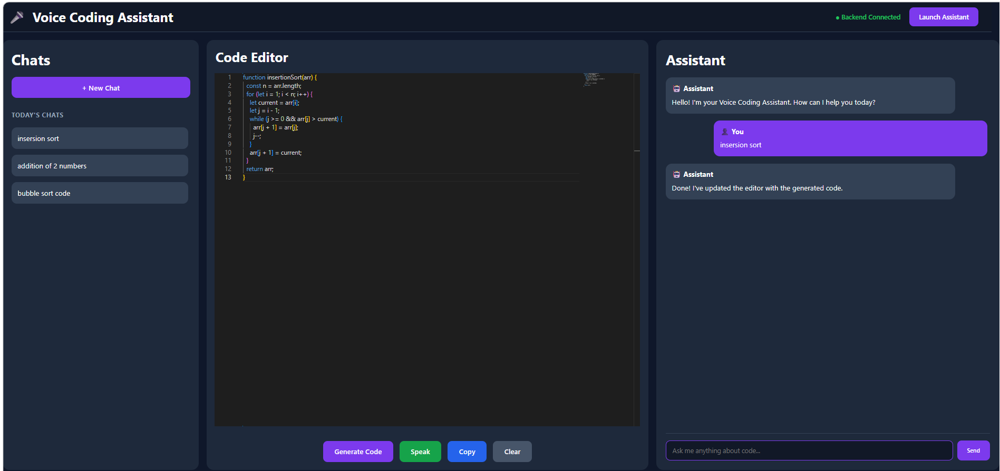
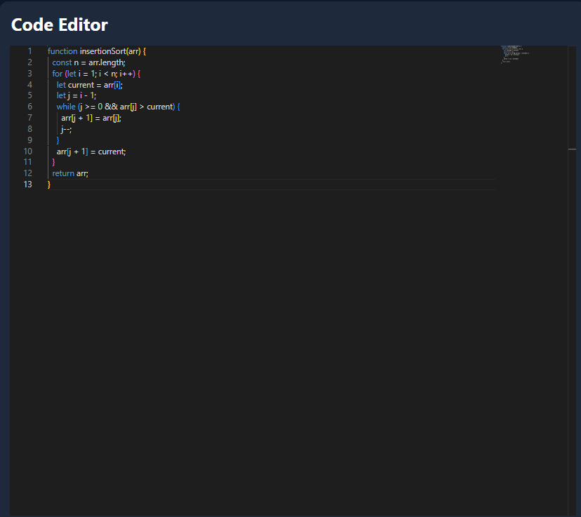
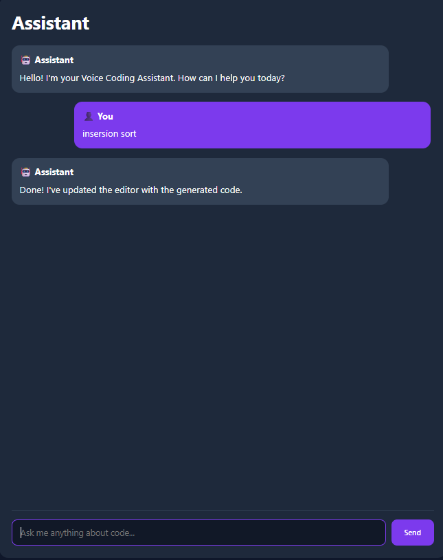
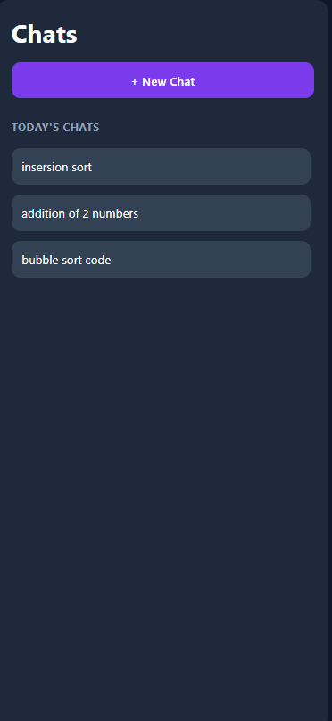

# 🎙️ Voice Coding Assistant (VCAI)

An AI-powered **Voice Coding Assistant** that enables developers to generate code using **voice** and **text commands**. The application integrates **React**, **FastAPI**, **Google Gemini**, and **Monaco Editor** to provide an interactive coding environment with AI-assisted code generation and chat-based interaction.

---
## 📷 Application Preview

### Home Screen



## 📖 Project Overview

Voice Coding Assistant (VCAI) is an AI-powered coding assistant that enables developers to interact with AI using both **voice** and **text commands**. The application combines an interactive **Monaco Code Editor** with an AI-powered assistant to help users generate, debug, optimize, convert, and explain code efficiently.

The frontend is built with **React**, while the backend uses **FastAPI** to communicate with the **Google Gemini API**. Speech recognition enables hands-free interaction, and chat history is stored locally to provide a seamless coding experience across browser sessions.

## ✨ Features

- 🎤 Voice-based code generation using browser Speech Recognition
- 💬 AI-powered text chat interface
- 📝 Monaco Code Editor integration
- 🤖 AI-assisted code generation
- 🐞 Code debugging assistance
- ⚡ Code optimization
- 🔄 Programming language conversion
- 📚 Code explanation
- 💾 Persistent chat history using Local Storage
- 📋 Copy generated code
- 🗑 Clear editor and start a new conversation
- 🌐 Multi-language support (C++, Java, Python, JavaScript, HTML, CSS)
- 🔌 FastAPI backend with Google Gemini integration

## 🛠️ Tech Stack

### Frontend
- React
- JavaScript (ES6+)
- CSS3
- Monaco Editor
- react-speech-recognition

### Backend
- FastAPI
- Python
- Google Gemini API

### Storage
- Browser Local Storage

### Development Tools
- Git
- GitHub
- Visual Studio Code

## 🏗️ Project Architecture

The application follows a client-server architecture where the React frontend handles user interactions and the FastAPI backend processes AI requests.

### Workflow

1. User provides input through **voice** or **text**.
2. Speech input is converted into text using **Browser Speech Recognition**.
3. The frontend detects the user's intent (Generate, Explain, Debug, Optimize, Convert).
4. A request is sent to the **FastAPI** backend.
5. The backend communicates with the **Google Gemini API**.
6. The AI-generated response is returned to the frontend.
7. Generated code is displayed inside the **Monaco Editor**, while the conversation is maintained in the Assistant panel.
8. Chat history is stored locally using **Local Storage**.

## 📸 Application Screenshots

### 🏠 Home Interface


---

### 💻 Monaco Code Editor



---

### 🤖 AI Assistant Panel



---

### 📂 Chat History



## ⚙️ Installation

### 1️⃣ Clone the Repository

```bash
git clone https://github.com/PayalJannawar/VCAI.git
cd Voice-Coding-Assistant
```

### 2️⃣ Backend Setup

```bash
cd backend

python -m venv venv

# Windows
venv\Scripts\activate

pip install -r requirements.txt

uvicorn main:app --reload
```

### 3️⃣ Frontend Setup

Open a new terminal.

```bash
cd frontend

npm install --legacy-peer-deps

npm run dev
```

### 4️⃣ Open the Application

Open your browser and visit:

```
http://localhost:5173
```

## 📂 Project Structure

```text
Voice-Coding-Assistant/
│
├── assets/                     # README screenshots
│
├── backend/
│   ├── main.py                 # FastAPI backend
│   ├── base_llm.py             # Gemini API integration
│   ├── requirements.txt
│   └── .env
│
├── frontend/
│   ├── public/
│   │   └── vite.svg
│   │
│   ├── src/
│   │   ├── components/
│   │   │   ├── Navbar.jsx
│   │   │   ├── Sidebar.jsx
│   │   │   ├── EditorPanel.jsx
│   │   │   ├── ConsolePanel.jsx
│   │   │   └── ControlButtons.jsx
│   │   │
│   │   ├── pages/
│   │   │   └── Home.jsx
│   │   │
│   │   ├── styles/
│   │   │   ├── navbar.css
│   │   │   ├── sidebar.css
│   │   │   ├── editor.css
│   │   │   ├── console.css
│   │   │   ├── layout.css
│   │   │   └── buttons.css
│   │   │
│   │   ├── App.jsx
│   │   ├── App.css
│   │   ├── main.jsx
│   │   └── index.css
│   │
│   ├── package.json
│   └── vite.config.js
│
└── README.md
```

## 🔄 Application Workflow

1. The user provides a coding request using **voice** or **text**.
2. Voice input is converted into text using the browser's **Speech Recognition API**.
3. The frontend analyzes the request and identifies the appropriate **intent** (Generate, Explain, Debug, Optimize, or Convert).
4. The request is sent to the **FastAPI backend**.
5. The backend forwards the request to the **Google Gemini API** for AI processing.
6. The AI-generated response is returned to the frontend.
7. Generated code is displayed inside the **Monaco Code Editor**.
8. The conversation is shown in the **Assistant Panel**.
9. Chat history is stored locally using **Local Storage**, allowing previous coding sessions to be restored.